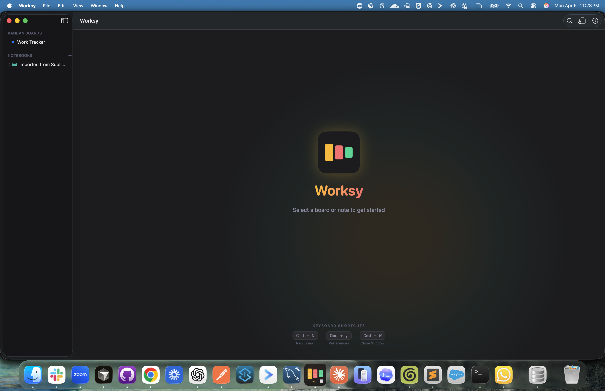
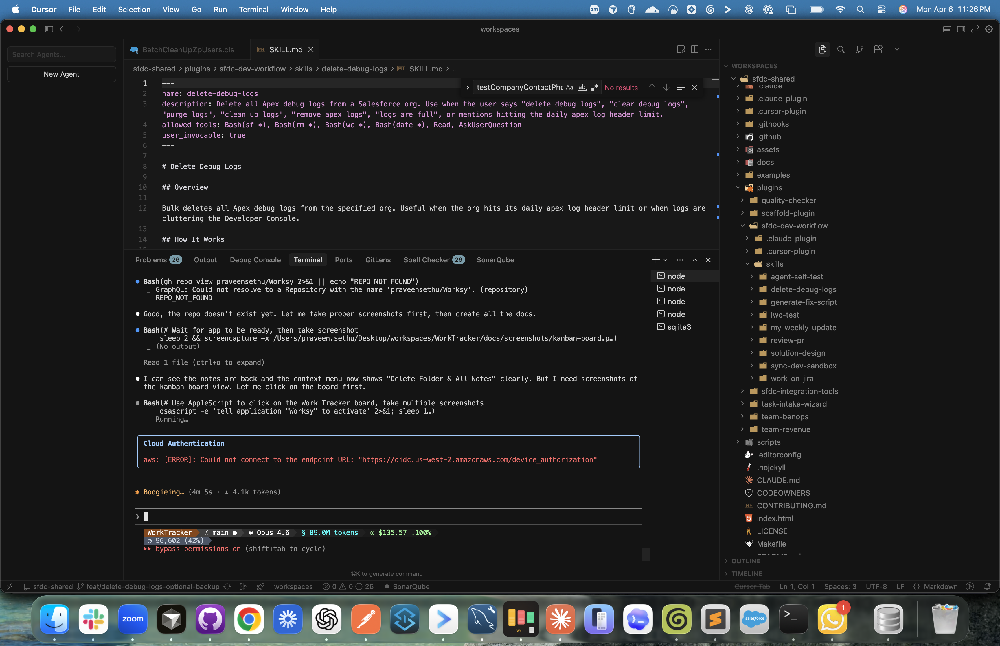

<p align="center">
  
</p>

<h1 align="center">Worksy</h1>

<p align="center">
  <strong>A native macOS Kanban board and note-taking app built with SwiftUI and Core Data</strong>
</p>

<p align="center">
  
  
  
  
  
</p>

---

## Features

### Kanban Boards
- **Drag & drop** cards between columns and reorder columns
- **Labels** — 8 preset labels (urgent, blocked, review, bug, feature, improvement, research, tech-debt) with color-coded badges
- **Due dates** with overdue indicators (red border + badge)
- **WIP limits** per column with visual warnings when exceeded
- **Pin cards** to the top of columns
- **Archive & restore** cards
- **Board templates** — Sprint Board, Personal Kanban, Bug Tracker, Feature Pipeline, Weekly Planner
- **Card detail sheet** with markdown description preview
- **Board statistics** — total cards, archived, overdue, per-column bar chart
- **Custom backgrounds** — 8 bundled images, 12 curated internet images, custom URL, daily rotation, shuffle
- **Export** boards as Markdown or CSV

### Notebooks
- **Rich text editor** with formatting toolbar (Bold, Italic, Underline, H1-H3, lists, code)
- **Folder hierarchy** with subfolders
- **Per-note context menus** — rename or delete individual notes without affecting the folder

### Global Features
- **Global search** across all cards and notes
- **Activity feed** — timeline of all create/update/move/delete actions
- **Undo/Redo** via Core Data's built-in undo manager
- **Dark theme** with warm amber/coral/emerald accent palette
- **Data migration** from Sublime Notes text files on first launch

---

## Architecture

```
Sources/Worksy/
├── WorksyApp.swift                  # App entry point, window config
├── ContentView.swift                # NavigationSplitView (sidebar + detail)
├── Models/
│   ├── Board+CoreData.swift         # Board managed object
│   ├── BoardColumn+CoreData.swift   # Column with WIP limits, active cards
│   ├── Card+CoreData.swift          # Card with labels, due dates, archive, pin
│   ├── Folder+CoreData.swift        # Folder hierarchy
│   ├── Note+CoreData.swift          # Rich text notes
│   └── AuditLog+CoreData.swift      # Audit trail entries
├── Persistence/
│   ├── CoreDataModel.swift          # Programmatic NSManagedObjectModel (no .xcdatamodeld)
│   └── PersistenceController.swift  # NSPersistentContainer setup
├── Services/
│   ├── AuditService.swift           # Singleton audit logger
│   ├── DataMigrationService.swift   # Import from Sublime Notes
│   └── ExportService.swift          # Markdown & CSV export
├── Theme/
│   ├── AppTheme.swift               # Colors, accents, dark theme
│   └── AppIconGenerator.swift       # Programmatic app icon
├── Views/
│   ├── WelcomeView.swift            # Landing page with keyboard shortcuts
│   ├── SidebarView.swift            # Board list + folder tree
│   ├── SearchView.swift             # Global search
│   ├── ActivityFeedView.swift       # Audit log timeline
│   ├── Kanban/
│   │   ├── KanbanBoardView.swift    # Board with background + columns
│   │   ├── ColumnView.swift         # Column with cards, WIP indicator
│   │   ├── CardView.swift           # Card tile with labels, due date
│   │   ├── CardDetailSheet.swift    # Card editor with markdown preview
│   │   ├── LabelPickerView.swift    # Label selector with FlowLayout
│   │   ├── BoardStatsView.swift     # Statistics popover
│   │   ├── ArchiveView.swift        # Archived cards list
│   │   ├── BackgroundPickerView.swift # Background image picker
│   │   └── BoardTemplates.swift     # Template definitions & picker
│   └── Notebooks/
│       ├── NotebookListView.swift   # All notebooks grid
│       ├── NoteEditorView.swift     # Rich text editor
│       ├── RichTextEditor.swift     # NSTextView wrapper
│       └── EditorToolbar.swift      # Formatting toolbar
└── Resources/
    └── Backgrounds/                 # 8 bundled background images
```

### Tech Stack

| Component | Technology |
|-----------|-----------|
| UI Framework | SwiftUI (macOS 14+) |
| Data Layer | Core Data with programmatic model |
| Storage | SQLite via NSPersistentContainer |
| Package Manager | Swift Package Manager |
| Build System | `swift build` (no Xcode project required) |

### Data Model

```
Board (1) ──── (*) BoardColumn (1) ──── (*) Card
  │
  └── backgroundImage, color, name, sortOrder

BoardColumn
  └── name, sortOrder, wipLimit

Card
  └── title, description, labels, dueDate, isArchived, isPinned, sortOrder

Folder (1) ──── (*) Note
  │      │
  │      └── (1) ──── (*) Folder (children)
  │
  └── name, sortOrder

Note
  └── title, content (NSAttributedString), createdAt, updatedAt

AuditLog
  └── action, entityType, entityId, field, oldValue, newValue, details, timestamp
```

### Key Design Decisions

1. **Programmatic Core Data Model** — No `.xcdatamodeld` file. The entire `NSManagedObjectModel` is built in code (`CoreDataModel.swift`), which makes it easier to version-control and modify.

2. **Swift Package, not Xcode Project** — Built as a Swift Package with `swift build`. The only Xcode-specific artifacts are the `.app` bundle structure for distribution.

3. **Lightweight Migration** — New optional attributes (dueDate, isArchived, isPinned, labels, wipLimit) are added with lightweight migration support. No manual migration mapping needed.

4. **Background Image Loading** — Bundled images load synchronously (small files, prevents flash). Custom/downloaded images load asynchronously to keep the UI responsive.

5. **Audit Trail** — Every CRUD operation logs to `AuditLog` via `AuditService`. This powers the Activity Feed without coupling views to each other.

---

## Getting Started

### Prerequisites
- macOS 14 (Sonoma) or later
- Swift 5.10+
- Xcode Command Line Tools

### Build & Run

```bash
# Clone the repo
git clone https://github.com/praveensethu/Worksy.git
cd Worksy

# Build
swift build

# Run
.build/debug/Worksy
```

### Install as App

```bash
# Build release
swift build -c release

# Copy to Applications (app bundle must exist)
cp .build/release/Worksy /Applications/Worksy.app/Contents/MacOS/Worksy
```

### Database Location

```
~/Library/Application Support/Worksy/Worksy.sqlite
```

Query it with:
```bash
sqlite3 -box ~/Library/Application\ Support/Worksy/Worksy.sqlite "SELECT * FROM ZBOARD;"
```

Or install [DB Browser for SQLite](https://sqlitebrowser.org/):
```bash
brew install --cask db-browser-for-sqlite
```

---

## Screenshots

| Welcome Screen | Kanban Board |
|:-:|:-:|
|  |  |

---

## Built With

- **100% AI-assisted** — Designed and implemented collaboratively with [Claude Code](https://claude.ai/code) (Claude Opus 4.6)
- Built from scratch in a single session — from concept to fully functional macOS app

---

## License

This project is licensed under the MIT License — see the [LICENSE](LICENSE) file for details.
